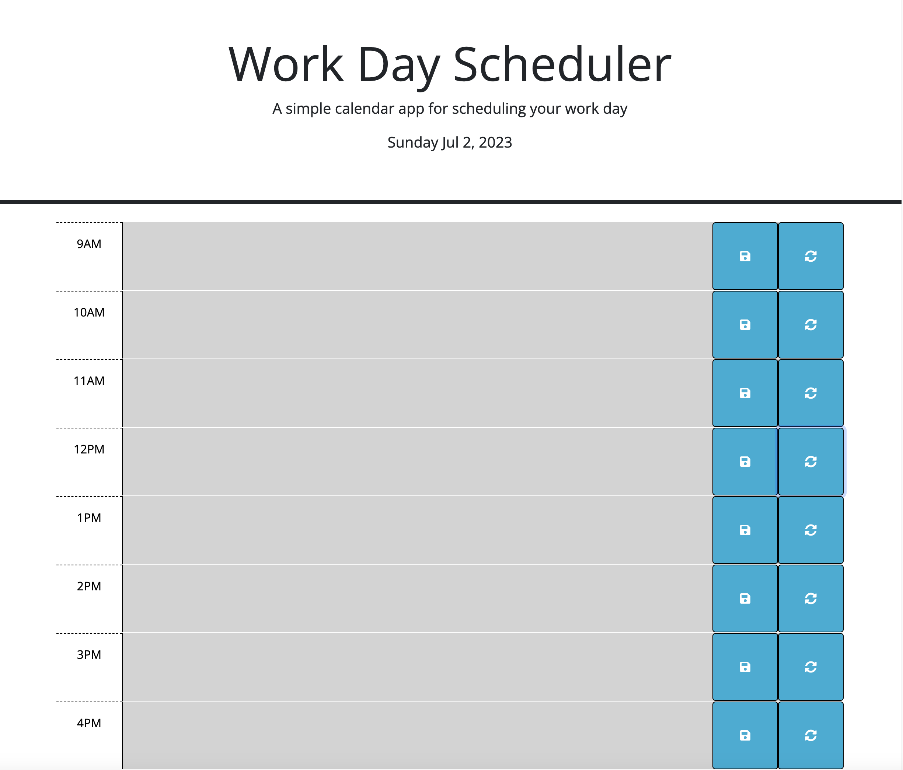
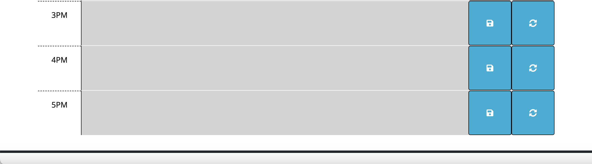
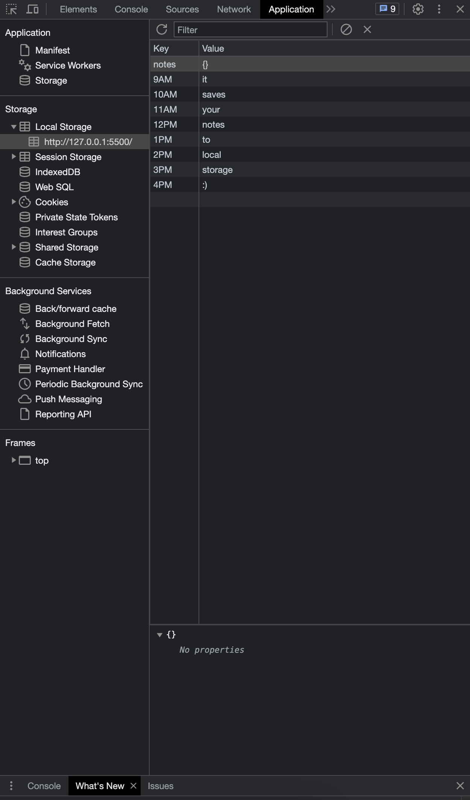

# Plan Ahead

## Overview
"Plan Ahead" is a simple yet effective daily planner. Designed for standard business hours (9:00 am to 5:00 pm), this planner allows users to manage their time efficiently by adding events to each time block of the day. The planner features color-coded time blocks representing past, present, and future events. Any event added to the planner is saved in local storage, ensuring your plans persist even when the page is refreshed.

## Features
- Current day displayed at the top of the calendar.
- Time blocks for standard business hours (9:00 am to 5:00 pm).
- Color-coded time blocks to indicate whether they are in the past, present, or future.
- Ability to add events to time blocks.
- Events are saved in local storage.
- Events persist after a page refresh.
- Ability to erase events with a simple click of the refresh button.

## Usage Guide
Simply scroll down to view the time blocks. Click on a time block to add an event, and click the save button to store it. Time blocks are color-coded to indicate whether they're in the past, present, or future. To erase an event, press the refresh button beside the hour you would like to erase.

## Screenshots

## Technologies Used
- HTML
- CSS
- JavaScript
- DayJS
- jQuery
- Bootstrap

## Live Demo
Check out the live version of this project [here](https://lightoftwelve.github.io/plan-ahead).

## Credits
This project was accepted and completed as part of the UofT SCS Coding Boot Camp Online: Fullstack Flex PT course through the University of Toronto. The original project (HTML and CSS) was created by edX Boot Camps LLC. and has been modified for the purpose of this assignment.

This project's JavaScript file was written by myself Victoria Alawi using jQuery, DayJS and Bootstrap.

- Github: [@lightoftwelve](https://github.com/lightoftwelve)
- LinkedIn: [@Victoria Alawi](https://www.linkedin.com/in/victoria-alawi-872984250/)
- Website: [www.lightoftwelve.com](http://www.lightoftwelve.com)

## License
This project is not currently licensed.
